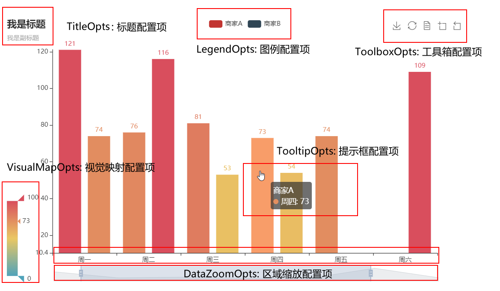

# 官网

[pyecharts - A Python Echarts Plotting Library built with love.](https://pyecharts.org/#/)

[中文简介 - Document (pyecharts.org)](https://gallery.pyecharts.org/#/README)


# 图表对象方法

```python
# -*- coding: UTF-8 -*-
from pyecharts.charts import Bar
from pyecharts import options as opts
# 使用 snapshot-selenium 渲染图片
# from snapshot_selenium import snapshot
# 内置主题类型可查看 pyecharts.globals.ThemeType
from pyecharts.globals import ThemeType


def fun1():
    # V1 版本开始支持链式调用
    # 你所看到的格式其实是 `black` 格式化以后的效果
    # 可以执行 `pip install black` 下载使用
    bar = (
        Bar()
        .add_xaxis(["衬衫", "羊毛衫", "雪纺衫", "裤子", "高跟鞋", "袜子"])
        .add_yaxis("商家A", [5, 20, 36, 10, 75, 90])
        .set_global_opts(title_opts=opts.TitleOpts(title="主标题", subtitle="副标题"))
        # 或者直接使用字典参数
        # .set_global_opts(title_opts={"text": "主标题", "subtext": "副标题"})
    )
    # 用来输出html文件的
    bar.render()


def fun2():
    # 不习惯链式调用的开发者依旧可以单独调用方法
    bar = Bar(init_opts=opts.InitOpts(theme=ThemeType.LIGHT, bg_color='#f8ddc0'))
    bar.add_xaxis(["衬衫", "羊毛衫", "雪纺衫", "裤子", "高跟鞋", "袜子"])
    bar.add_yaxis("商家A", [5, 20, 36, 10, 75, 90])
    bar.set_global_opts(title_opts=opts.TitleOpts(title="主标题", subtitle="副标题"))
    bar.set_series_opts(label_opts=opts.LabelOpts(is_show=False, position='right'))
    # 用来输出html文件的，参数可以设定文件名字
    bar.render()
    bar.render()

fun2()
```

```python
def set_global_opts(
    self,
    title_opts: types.Title = opts.TitleOpts(),
    legend_opts: types.Legend = opts.LegendOpts(),
    tooltip_opts: types.Tooltip = None,
    toolbox_opts: types.Toolbox = None,
    brush_opts: types.Brush = None,
    xaxis_opts: types.Axis = None,
    yaxis_opts: types.Axis = None,
    visualmap_opts: types.VisualMap = None,
    datazoom_opts: types.DataZoom = None,
    graphic_opts: types.Graphic = None,
    axispointer_opts: types.AxisPointer = None,
):
    
    
def set_series_opts(
    self,
    label_opts: types.Label = None,
    linestyle_opts: types.LineStyle = None,
    splitline_opts: types.SplitLine = None,
    areastyle_opts: types.AreaStyle = None,
    axisline_opts: types.AxisLine = None,
    markpoint_opts: types.MarkPoint = None,
    markline_opts: types.MarkLine = None,
    markarea_opts: types.MarkArea = None,
    effect_opts: types.Effect = opts.EffectOpts(),
    tooltip_opts: types.Tooltip = None,
    itemstyle_opts: types.ItemStyle = None,
    **kwargs,
):
    
    
class Bar():
    def add_yaxis(
        # 系列名称，用于 tooltip 的显示，legend 的图例筛选。
        series_name: str,
        # 系列数据
        y_axis: Sequence[Numeric, opts.BarItem, dict],
        # 是否选中图例
        is_selected: bool = True,
        # 使用的 x 轴的 index，在单个图表实例中存在多个 x 轴的时候有用。
        xaxis_index: Optional[Numeric] = None,
        # 使用的 y 轴的 index，在单个图表实例中存在多个 y 轴的时候有用。
        yaxis_index: Optional[Numeric] = None,
```

<font color='red'>init_opts：</font>初始化属性，传入一个InitOpts对象（通过改对象可以设置比如主题和背景色，画布大小等）

<font color='red'>add_xaxis：</font>添加x轴数据，就一个参数数据没有其他参数

<font color='red'>add_yaxis：</font>添加y轴数据，参数众多具体看官网每个图表的api接口，yaxis_index是配合底下层叠图使用

<font color='red'>set_global_opts：</font>全局配置项，一些表示含义见下图



<font color='red'>set_series_opts：</font>局部配置项，主要包含一些图表内部比较细致的配置，线条颜色、文字样式等等


# Pyecharts随机生成数

```python
Faker.choose()  # 随机产生同属的7个名词
Faker.values()   # 随机7个数据
Faker.country   # 生成7个国家和英文名列表
Faker.cars # 生成7个汽车品牌的列表
Faker.visual_color # 随机颜色列表
Faker.days_attrs #  'number天'字符串列表
Faker.clock # 生成时间字符串列表
Faker.dogs # 生成7种狗的列表
Faker.guangdong_city # 生成广东省下面7个市的固定列表
Faker.img_path(r'C:\abc.jpg') # 返回图片路径
Faker.week_en # 英文的星期一到日 作者：穿云蟒 https://www.bilibili.com/read/cv12318995 出处：bilibili
```


# 多图组合

并行指的是一个画布里放多个图表，要自己设置位置参数让他们分开否者这些图表就有可能叠在一起了

层叠指的多个图表叠在一个坐标系里

顺序指的就是不需要自己设置位置参数，图表按照顺序一个个从上到下的显示

## 并行多图Grid

```python
from pyecharts.charts import Line,Grid,Bar
from pyecharts import options as opts
columns = [str(i) for i in range(1,12)]
data1 = [i for i in range(1,12)]
data2 = [i*2 for i in range(1,12)]

# 设置柱状图
bar = Bar()
bar.add_xaxis(["衬衫", "羊毛衫", "雪纺衫", "裤子", "高跟鞋", "袜子"])
bar.add_yaxis("商家A", [5, 20, 36, 10, 75, 90])
bar.add_yaxis("商家B", [5, 20, 36, 10, 75, 90])
bar.set_global_opts(title_opts=opts.TitleOpts(title="bar", subtitle="副标题",pos_top='top'),
                    legend_opts=opts.LegendOpts(pos_top='top'))
# 设置折线图标题位置
line = Line()
line.add_xaxis(columns)
line.add_yaxis("降水量", data1)
line.add_yaxis("蒸发量", data2)
line.set_global_opts(title_opts=opts.TitleOpts(title="line", pos_top='middle'),
                     legend_opts=opts.LegendOpts(pos_top='middle'))
grid = Grid()
# 设置两个图表的相对位置
grid.add(bar,grid_opts=opts.GridOpts(pos_bottom='60%'))
grid.add(line,grid_opts=opts.GridOpts(pos_top='60%'))
grid.render()

```

这里麻烦在设置图表、标题、图例等时候的位置，通过pos_top来控制位置，这里的离容器上侧的距离指的是距离整个网页的位置属于绝对位置，否者图例或标题等就可能重合在一起了。通过grid对象的add方法一个个加图表

[组合图表 - pyecharts - A Python Echarts Plotting Library built with love.](https://pyecharts.org/#/zh-cn/composite_charts?id=grid：并行多图)

## 层叠Overlap

```python
from pyecharts import options as opts
from pyecharts.charts import Bar, Line
from pyecharts.faker import Faker

v1 = [2.0, 4.9, 7.0, 23.2, 25.6, 76.7, 135.6, 162.2, 32.6, 20.0, 6.4, 3.3]
v2 = [2.6, 5.9, 9.0, 26.4, 28.7, 70.7, 175.6, 182.2, 48.7, 18.8, 6.0, 2.3]
v3 = [2.0, 2.2, 3.3, 4.5, 6.3, 10.2, 20.3, 23.4, 23.0, 16.5, 12.0, 6.2]


bar = (
    Bar()
    .add_xaxis(Faker.months)
    .add_yaxis("蒸发量", v1)
    .add_yaxis("降水量", v2)
    .extend_axis(
        yaxis=opts.AxisOpts(
            axislabel_opts=opts.LabelOpts(formatter="{value} °C"), interval=5
        )
    )
    .set_series_opts(label_opts=opts.LabelOpts(is_show=False))
    .set_global_opts(
        title_opts=opts.TitleOpts(title="Overlap-bar+line"),
        yaxis_opts=opts.AxisOpts(axislabel_opts=opts.LabelOpts(formatter="{value} ml")),
    )
)

line = Line().add_xaxis(Faker.months).add_yaxis("平均温度", v3, yaxis_index=1)
bar.overlap(line)
bar.render("overlap_bar_line.html")
```

通过一个图表对象.overlap另一个图表对象来进行叠加

通过主图表对象的extend_axis方法增加一个坐标轴，然后再使用add_yaxis添加数据，同时指定y轴索引yaxis_index=1

相当于主图表比如上面bar的yaxis_index是0使用默认y轴，新加一个坐标轴就和yaxis_index=1的绑定，再增加的话就和index=2的绑定


## 顺序多图Page

```python
from pyecharts import options as opts
from pyecharts.charts import Bar, Line, Page
from pyecharts.faker import Faker


def bar_datazoom_slider() -> Bar:
    c = (
        Bar()
        .add_xaxis(Faker.days_attrs)
        .add_yaxis("商家A", Faker.days_values)
        .set_global_opts(
            title_opts=opts.TitleOpts(title="Bar-DataZoom（slider-水平）"),
            datazoom_opts=[opts.DataZoomOpts()],
        )
    )
    return c


def line_markpoint() -> Line:
    c = (
        Line()
        .add_xaxis(Faker.choose())
        .add_yaxis(
            "商家A",
            Faker.values(),
            markpoint_opts=opts.MarkPointOpts(data=[opts.MarkPointItem(type_="min")]),
        )
        .add_yaxis(
            "商家B",
            Faker.values(),
            markpoint_opts=opts.MarkPointOpts(data=[opts.MarkPointItem(type_="max")]),
        )
        .set_global_opts(title_opts=opts.TitleOpts(title="Line-MarkPoint"))
    )
    return c


def page_simple_layout():
    page = Page(layout=Page.SimplePageLayout)
    page.add(
        bar_datazoom_slider(),
        line_markpoint()
    )
    page.render("page_simple_layout.html")


if __name__ == "__main__":
    page_simple_layout()

```

创建Page对象，然后把图表对象一个个加进去就好了

# WEB整合

## 网站输出

这里看Sanic的范例，代码实现起来前后端分离。

流程：新建一个项目文件夹(空的即可)，新建 app.py、templates 文件夹以及在 templates 文件夹中新建 index.html。

```html
<!DOCTYPE html>
<html>
<head>
    <meta charset="UTF-8">
    <title>Awesome-pyecharts</title>
    <script src="https://cdn.bootcss.com/jquery/3.0.0/jquery.min.js"></script>
    <script type="text/javascript" src="https://assets.pyecharts.org/assets/echarts.min.js"></script>

</head>
<body>
    <div id="bar" style="width:1000px; height:600px;"></div>
    <script>
        var chart = echarts.init(document.getElementById('bar'), 'white', {renderer: 'canvas'});

        $(
            function () {
                fetchData();
            }
        );

        function fetchData() {
            $.ajax({
                type: "GET",
                url: "http://127.0.0.1:8000/barChart",
                dataType: 'json',
                success: function (result) {
                    chart.setOption(JSON.parse(result));
                }
            });
        }
    </script>
</body>
</html>
```

```python
from random import randrange

from sanic import Sanic
from sanic.response import json, html

from pyecharts import options as opts
from pyecharts.charts import Bar

# 初始化 Sanic
app = Sanic(__name__)


def bar_base() -> Bar:
    c = (
        Bar()
        .add_xaxis(["衬衫", "羊毛衫", "雪纺衫", "裤子", "高跟鞋", "袜子"])
        .add_yaxis("商家A", [randrange(0, 100) for _ in range(6)])
        .add_yaxis("商家B", [randrange(0, 100) for _ in range(6)])
        .set_global_opts(title_opts=opts.TitleOpts(title="Bar-基本示例", subtitle="我是副标题"))
    )
    return c


@app.route("/barChart", methods=["GET"])
async def draw_bar_chart(request):
    c = bar_base()
    return json(c.dump_options_with_quotes())


@app.route("/", methods=["GET"])
async def index(request):
    return html(open("./templates/index.html").read())


if __name__ == '__main__':
    app.run()
```

解析下，html文件里url: "http://127.0.0.1:8000/barChart"这里的barChart需要对应python代码里@app.route("/barChart", methods=["GET"])第一个参数的


## 定时全量更新

定时刷新的核心在于 html 的 setInterval方法，这个方法第二个参数就是刷新的频率

```html
<!DOCTYPE html>
<html>
<head>
    <meta charset="UTF-8">
    <title>Awesome-pyecharts</title>
    <script src="https://cdn.bootcss.com/jquery/3.0.0/jquery.min.js"></script>
    <script type="text/javascript" src="https://assets.pyecharts.org/assets/echarts.min.js"></script>

</head>
<body>
    <div id="bar" style="width:1000px; height:600px;"></div>
    <script>
        var chart = echarts.init(document.getElementById('bar'), 'white', {renderer: 'canvas'});

        $(
            function () {
                fetchData();
                setInterval(fetchData, 2000);
            }
        );

        function fetchData() {
            $.ajax({
                type: "GET",
                url: "http://127.0.0.1:8000/barChart",
                dataType: "json",
                success: function (result) {
                    chart.setOption(JSON.parse(result));
                }
            });
        }
    </script>
</body>
</html>
```

```python
from random import randrange

from sanic import Sanic
from sanic.response import json, html

from pyecharts import options as opts
from pyecharts.charts import Bar

# 初始化 Sanic
app = Sanic(__name__)


def bar_base() -> Bar:
    c = (
        Bar()
        .add_xaxis(["衬衫", "羊毛衫", "雪纺衫", "裤子", "高跟鞋", "袜子"])
        .add_yaxis("商家A", [randrange(0, 100) for _ in range(6)])
        .add_yaxis("商家B", [randrange(0, 100) for _ in range(6)])
        .set_global_opts(title_opts=opts.TitleOpts(title="Bar-基本示例", subtitle="我是副标题"))
    )
    return c


@app.route("/barChart", methods=["GET"])
async def draw_bar_chart(request):
    c = bar_base()
    return json(c.dump_options_with_quotes())


@app.route("/", methods=["GET"])
async def index(request):
    return html(open("./templates/index.html").read())


if __name__ == '__main__':
    app.run()
```

## 定时增量更新图表

和上面的差别是，数据是在前面图基础上增加进去的，会多一个函数

```html
<!DOCTYPE html>
<html>
<head>
    <meta charset="UTF-8">
    <title>Awesome-pyecharts</title>
    <script src="https://cdn.bootcss.com/jquery/3.0.0/jquery.min.js"></script>
    <script type="text/javascript" src="https://assets.pyecharts.org/assets/echarts.min.js"></script>

</head>
<body>
    <div id="bar" style="width:1000px; height:600px;"></div>
    <script>
        var chart = echarts.init(document.getElementById('bar'), 'white', {renderer: 'canvas'});
        var old_data = [];
        $(
            function () {
                fetchData();
                setInterval(getDynamicData, 2000);
            }
        );

        function fetchData() {
            $.ajax({
                type: "GET",
                url: "http://127.0.0.1:8000/lineChart",
                dataType: "json",
                success: function (result) {
                    chart.setOption(JSON.parse(result));
                    old_data = chart.getOption().series[0].data;
                }
            });
        }

        function getDynamicData() {
            $.ajax({
                type: "GET",
                url: "http://127.0.0.1:8000/lineDynamicData",
                dataType: "json",
                success: function (result) {
                    old_data.push([result.name, result.value]);
                    chart.setOption({
                        series: [{
                            data: old_data
                        }]
                    });
                }
            });
        }

    </script>
</body>
</html>
```

```python
from random import randrange

from sanic import Sanic
from sanic.response import json, html

from pyecharts import options as opts
from pyecharts.charts import Line

# 初始化 Sanic
app = Sanic(__name__)


def line_base() -> Line:
    line = (
        Line()
        .add_xaxis(list(range(10)))
        .add_yaxis(series_name="", y_axis=[randrange(0, 100) for _ in range(10)])
        .set_global_opts(
            title_opts=opts.TitleOpts(title="动态数据"),
            xaxis_opts=opts.AxisOpts(type_="value"),
            yaxis_opts=opts.AxisOpts(type_="value")
        )
    )
    return line


@app.route("/lineChart", methods=["GET"])
async def draw_line_chart(request):
    c = line_base()
    return json(c.dump_options_with_quotes())

cnt = 9

@app.route("/lineDynamicData", methods=["GET"])
async def update_line_data(request):
    global cnt
    cnt = cnt + 1
    return json({"name": cnt, "value": randrange(0, 100)})


@app.route("/", methods=["GET"])
async def index(request):
    return html(open("./templates/index.html").read())


if __name__ == '__main__':
    app.run()
```

## 打开多个网页方法

grid叠加图片很难控制位置，多于2个图总会重叠一起，page方法又不能输出给js所以试着输出多个地址方法如下：

1、多建立一个index2.html文件，修改里面地址或者端口改改都行

```html
url: "http://127.0.0.1:8001/barChart",
```

2、python的代码也新建一个，修改里面的app.run()

```python
@app.route("/", methods=["GET"])
async def index(request):
    # 指向刚才修改的html
    return html(open("./templates/index2.html").read())


if __name__ == '__main__':
    # 设置端口,如果改地址的话就要写host='127.0.0.2'这种，和上面html对应
    app.run(port=8001)
```

3、两个python程序要分别启动，然后打开各自的网页即可

# 案例

## bar叠加两条line图

<font color='red'>实际用的时候不要一个对象多次set_global_opts，特别多图grid时候，因为设置属性时候会有默认参数，默认参数可能会覆盖我们前面设置好的属性，下面例子只是为了介绍各个属性方便所以分开了</font>

```python
from pyecharts import options as opts
from pyecharts.charts import Bar, Grid, Line
from pyecharts import faker

code = faker.Faker.country
# 创建bar图表
bar = Bar(init_opts=opts.InitOpts())
bar.add_xaxis(code)
# 添加数据，设置bar的标签、数据、yaxis_index、label_opts是否显示、bar柱体颜色,这里颜色最后一个参数是alpha透明度
bar.add_yaxis('保证金', faker.Faker.values(10, 200), yaxis_index=0, label_opts=opts.LabelOpts(is_show=True), color='rgba(132, 100, 211, 0.5)')
# 全局设置，x轴上数据的角度、颜色，title显示内容
bar.set_global_opts(xaxis_opts=opts.AxisOpts(axislabel_opts={"rotate": 60, 'color': 'blue'}),title_opts=opts.TitleOpts(title='柱状净持仓', subtitle="线图保证金"))
# 全局设置，y轴显示名称、位置、轴线的style(颜色)、坐标轴显示单位
bar.set_global_opts(yaxis_opts=opts.AxisOpts(name="保证金", position="left",axisline_opts=opts.AxisLineOpts(linestyle_opts=opts.LineStyleOpts(color="#675bba")),axislabel_opts=opts.LabelOpts(formatter="{value} 万"),splitline_opts=opts.SplitLineOpts(is_show=True, linestyle_opts=opts.LineStyleOpts(opacity=1))))
# 全局设置，增加一个十字光标提示
bar.set_global_opts(tooltip_opts=opts.TooltipOpts(trigger="axis", axis_pointer_type="shadow"))
# 增加一个坐标轴，设置好y轴显示名称等的功能,设置min和max最大范围一致可以让坐标轴0在0轴上
bar.extend_axis(yaxis=opts.AxisOpts(name="第一个轴",min_=-1000,max_=1000, type_="value",position="right",axisline_opts=opts.AxisLineOpts(is_on_zero=True,linestyle_opts=opts.LineStyleOpts(color="#3979b3"))))
# 再增加一个坐标轴，设置好y轴显示名称等的功能，offset用来表示偏移多少
bar.extend_axis(yaxis=opts.AxisOpts(offset=50, name="第二个轴", type_="value", position="right",
axisline_opts=opts.AxisLineOpts(is_on_zero=True,linestyle_opts=opts.LineStyleOpts(color="#3979b3"))))
line = Line()
line.add_xaxis(code)
# yaxis_index用来和上面增加的坐标轴对应上，通过让1和2对换看效果
line.add_yaxis('第一个轴', faker.Faker.values(10, 200), yaxis_index=1)
line.add_yaxis('第二个轴', faker.Faker.values(10, 200), yaxis_index=2)
c = bar.overlap(line)
c.render()

```

